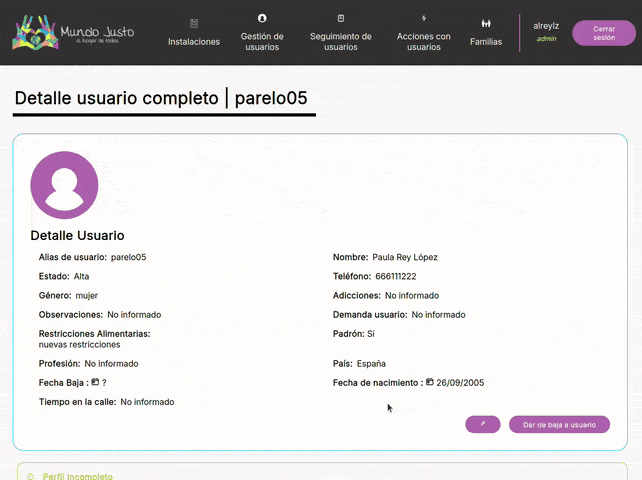
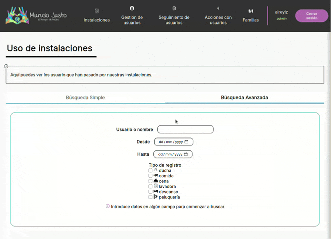
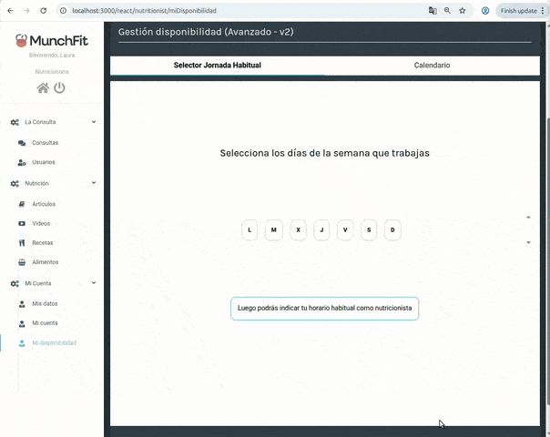

<h1 align="center"> Alejandro Rey  
</h1> 

 

 👋 Hi, I’m Alejandro Rey (@alreylz on the web). I am a BsC. and MsC. in Computer Science based in Madrid, Spain.

 
👀 I’m interested in HCI in Immersive Environments (VR/AR/MR) and most of my work has been on research and development for these technologies and the web.

 
🌱
  I am last year PhD student in Computer Science at uc3m (Madrid), working with Unity and studying the impact of multisensory feedback in Immersive Analytics applications.
  I was previously working at <a href="https://espaciosoa.com/">Espaciosoa</a> as a Fullstack web developer and have done several solo professional development work regarding web and web-dev during such period. Pretty all over the place, huh? 
 

 
💞️ I am looking for job opportunities in development and possibly its intersection with research. More specifically, I am interested on data visualization in both VR and web environments and/or HCI Research on the same topic. 

 📫 How to reach me <a href="mailto:alreylop@gmail.com">alreylop@gmail.com</a>  (main) 

 
<!--

   

-->

  
<h2 align="center"> 🚀 Featured Projects   </h2>

   
  <h3>   InMap - Indoors Signal Mapper Suite 
  </h3>
  
 <b>InMap</b> is a Software tool for indoors heatmapping that provides quality results at an affordable price, for arquitects, indoors planners and signal repeaters.

  
 <h4>Full suite developed (completely on my own) during my internship at <a href="https://espaciosoa.com/">Espaciosoa </a></h4>

<table>
  <tr>
    <td align="center"></td>
    <td align="center">  </td>
    <td align="center"></td>
  </tr>
  <tr>
    <td align="center">🔗<a href="https://github.com/espaciosoa/inmap-app">  Android App </a></td>
    <td align="center">🔗<a href="https://github.com/espaciosoa/inmap-web"> Web visualizer </a></td>
    <td align="center">🔗<a href="https://github.com/espaciosoa/inmap-pi"> Precise measurement module for Raspberry-Pi</a></td>
  </tr>
</table>

   
  <h3>  Mundo Justo - User and facilty management</h3>
 <a href="https://www.mundojusto.org/">Mundo Justo</a> is an ONG focused on providing help to homeless people, which goes from facilitaing them a shower or a place to sleep at night, to legal and psychological support.  
  

<table align="center">
  <tr>
    <td align="center">
      
    </td>
    <td align="center">
      
    </td>
  </tr>
  <tr>
    <td align="center"><b>Mundo justo deployed version</b></td>
    <td align="center">🖼️ <b>Picture management</b></td>
  </tr>
  <tr>
    <td align="center">
      
    </td>
    <td align="center">
      
    </td>
  </tr>
  <tr>
    <td align="center">🔍 <b>Search of users</b></td>
    <td align="center">🔍 <b>ONG Facilities search</b></td>
  </tr>
  <tr>
    <td align="center" colspan="2">
      
    </td>
  </tr>
  <tr>
    <td align="center" colspan="2">⚙️ <b>User creation example flow</b></td>
  </tr>
</table>

 

 I developed this user management application to optimize their processes and keep track of the use of their facilities and resources.
 Developed fully in Typescript and with native CSS styles, no libraries, 
 I engineered the whole thing, and coded both frontend and backend APIS to handle a variety of use cases, such as single users or families, implementing advanced search capabilities and 3 types of users (ONG attendees, volunteers and administrators). I also handled all the detail of the delivery of this project, from DNS configuration to <b>database migration and conversion from their legacy system (Excel sheets)</b> to the MongoDB model I designed.
 
  
   
 

  
  
  
  
  
  

 

 

  

  
  
 
  <h3>  MunchFit app website </h3>  
  <h4>Developed during my internship at <a href="https://espaciosoa.com/">Espaciosoa </a></h4>
   
 MunchFit is a personalized nutrition Android application designed by nutritionists for people who regularly practice some sport and whose plans are programatically generated from an algorithm designed by nutritionist with health in mind.
  
   

 <table>
  <tr>
    <td align="center">

    </td>
     <td align="center">

 </td>
  </tr>
  <tr>
    <td align="center"> App showcase</td>
    <td align="center"> Responsive design</td>
  </tr>

  <tr>
    <td align="center" colspan="2">
      
    </td>
  </tr>
  <tr>
    <td align="center" colspan="2">⚙️ <b>Complex Custom UI and logic for managing availability of Nutritionists </b></td>
  </tr>
 </table>

  
  I fully redesigned the advertising website for the app, made it responsive and more attractive (creating clearer structure and nice hero sections with call to action buttons). I implemented the multilingual support (es, en and fr) and a <b>fully featured app demo section</b> (which I'm proudest about) with CSS animations and the <b>custom radial menu system</b> to show the alternative of dishes for each meal and its possible configurations. This project required me to understand deeply how the company handled recipes in the backend and I had to merge backend information to reconstruct all the recipes shown in the web (so yes, they are actual recipes from the application).
   
   
  In the private area of the website, I extended the content management system with multimedia capabilities, and designed from scratch a reactive availability management system for independent nutritionists to customize their working hours with very high granularity.

 

  

  
  
  
  

  
   

  
   
  <h3>  Colibrí Airlines - Trip planning to Japan </h3>
  

 

 

 Hobby project that takes all the collaboratively curated planning for a holiday trip to Japan and displays in an interactive manner for all friends going to the trip.
  
 The project is deployed at <a href="https://japan.alreylz.me/" >japan.alreylz.me </a> requiring authentication and mail whitelisting from me to use (feel free to email me). It leverages the Google Sheets API and Leaflet to display information over the map. Allows filtering and displays images of the main interest points to visit.
     

  
  
  

 

 

  
  
  <h3>  Guitar vs Bass classifier </h3>
  <h4> <a href="https://github.com/alreylz/GuitarBassClassificationCNN"> See repo </a> </h4>
 
  

This is a Convolutional Neural Network project carried out for the Automated Programming course of the MsC. in Computer Science and Techonology at Universidad Carlos III de Madrid The project consists mainly of two Google Colab Notebooks, one for the web-scraper and another for the CNN.  
The scraper Thomann_Web_Scraping_coredamnwork.ipynb is probably deprecated by now just because of the changes that that Thomann's website might have suffered. This script makes use of the requests and BeautifulSoup libraries. The resulting <a href="https://drive.google.com/drive/folders/12QiXJj9cZJzijI63JD5-70n2o_QhvOj5?usp=sharing"> dataset </a> contains 8000 images of bass and guitars (150x150 RGB, thumbnail-like). There is an imbalance on the number of guitars (6924) vs bass images (1076).   
The CNNs is implemented in Pytorch (see Bass&Guitar_Convolutional_Net_coredamnwork.ipynb) and everything was tested on top of Google Colab/Drive File System. You can find the full report of the project and the final presentation in the /docs folder (in Spanish though).
 
     

  
 
  
 

 
 

 

 

<section id="CHIC-Farmlab" >
 
 

   
    
   <h3> CHIC-Farmlab </h3>
   <h4> <a href="https://github.com/alreylz/CHIC-Farm-Lab"> See repo </a> </h4>
  
   
 

 
 

 Augmented Reality Game targeted at Hololens 1/2 designed to teach adolescents about NPBTs (New Plant Breeding Techniques editing). 
   
  The game was part of the dissemination program involved in the <a href="https://chicproject.eu/">chic.eu</a> project. CHIC was a project that revolved around the Chicory plant, which has the very characteristic flower that you can see in all its branding and subordinate projects.  
 I developed the game prototype during my period as Research Assistant at DEI Interactive Systems I designed everything in the game, specifically all sprites and 3D objects (except for the insects and weather particles). Telmo Zarraonandia Ayo contributed to the development and migration of the application to Hololens 2.
      
 

   
   
   
 

 

 
</section>

 

<!--I am actively looking for a job to start from **October 2024**, so feel free to contact me for job opportunities. -->

<!-- -->

<!--<h3 align="left">Languages and Tools:</h3> -->
<!-- 
Unity C# Javascript JEST MongoDB MySQL HTML CSS SASS  SpringBoot JavaEE  Webdev concepts: Websockets, JWT, cookies, REST, Python, Photoshop Illustrator 
-->

<!---
coredamnwork/coredamnwork is a ✨ special ✨ repository because its `README.md` (this file) appears on your GitHub profile.
You can click the Preview link to take a look at your changes.
--->
